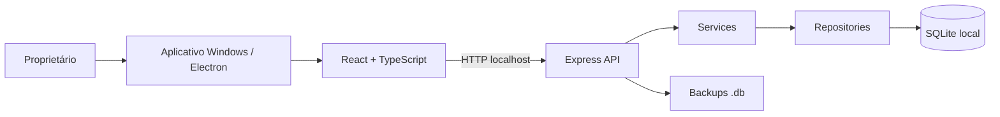
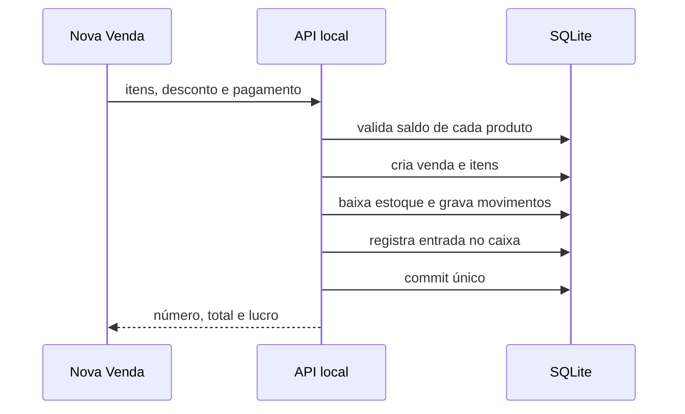

# Arquitetura técnica

## Visão geral

O processo principal do Electron abre a janela, encontra a pasta local de dados do Windows e inicia a API apenas em `127.0.0.1` numa porta aleatória. Não existe conexão com a internet nem serviço externo.

## Camadas

| Camada | Responsabilidade |
|---|---|
| `frontend` | Componentes React, rotas, formulários, feedbacks e exportações. |
| `controllers` | Recebe a requisição HTTP, valida o DTO e retorna a resposta. |
| `services` | Regras de negócio, cálculos, transações e decisões de domínio. |
| `repositories` | SQL parametrizado e mapeamento de persistência. |
| `database` | Migrations SQL e seed opcional. |
| `electron` | Ciclo de vida desktop, PDF e empacotamento Windows. |

## Fluxo da venda

Caso um produto não tenha saldo ou qualquer etapa apresente erro, a transação é desfeita integralmente. O sistema não deixa uma venda gravada sem movimentar estoque e caixa.

## Segurança e confiabilidade

- SQLite em modo WAL e com chaves estrangeiras habilitadas.
- Consultas SQL parametrizadas, sem concatenação de dados do usuário.
- Zod valida campos, valores e enums na entrada da API.
- Valores financeiros em inteiro (centavos).
- Confirmação visual antes de remoções e restauração de backup.
- Produtos usados em venda são arquivados, não apagados.
- Backup antes de importação e opção de backup automático diário.
