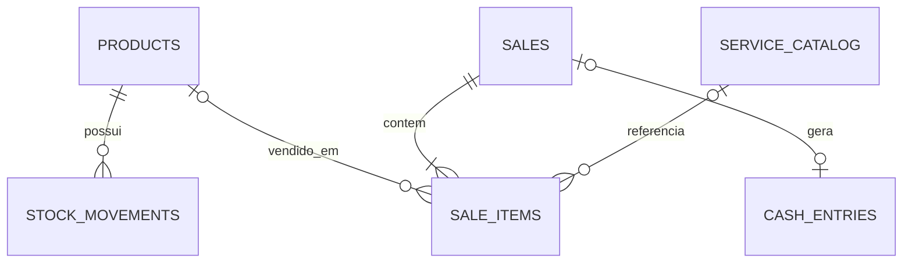

# Modelo de dados

| Tabela | Finalidade |
|---|---|
| `products` | Pneus, rodas e bicos; campos específicos por tipo, localização do pneu, preços, saldo e estoque mínimo. |
| `stock_movements` | Auditoria de estoque inicial, entrada, saída, ajuste e venda. |
| `service_catalog` | Somente alinhamento e balanceamento, com preço editável. |
| `sales` | Cabeçalho da venda: veículo, desconto, pagamento, totais, lucro e observação. |
| `sale_items` | Produtos, serviços tabelados ou mão de obra; guarda preço/custo histórico. |
| `cash_entries` | Entradas de venda e saídas/entradas manuais. |
| `settings` | Nome da empresa, mínimo padrão e preferência de backup automático. |
| `schema_migrations` | Controle das migrations aplicadas. |

## Cálculos

- `subtotal = Σ item.quantidade × item.preço_unitário`
- `total = subtotal − desconto`
- `custo = Σ produto.quantidade × custo_unitário histórico`
- `lucro = total − custo`

O desconto é aplicado ao lucro da venda. Como não há custo direto cadastrado para alinhamento, balanceamento e mão de obra, esses itens entram com custo zero.
